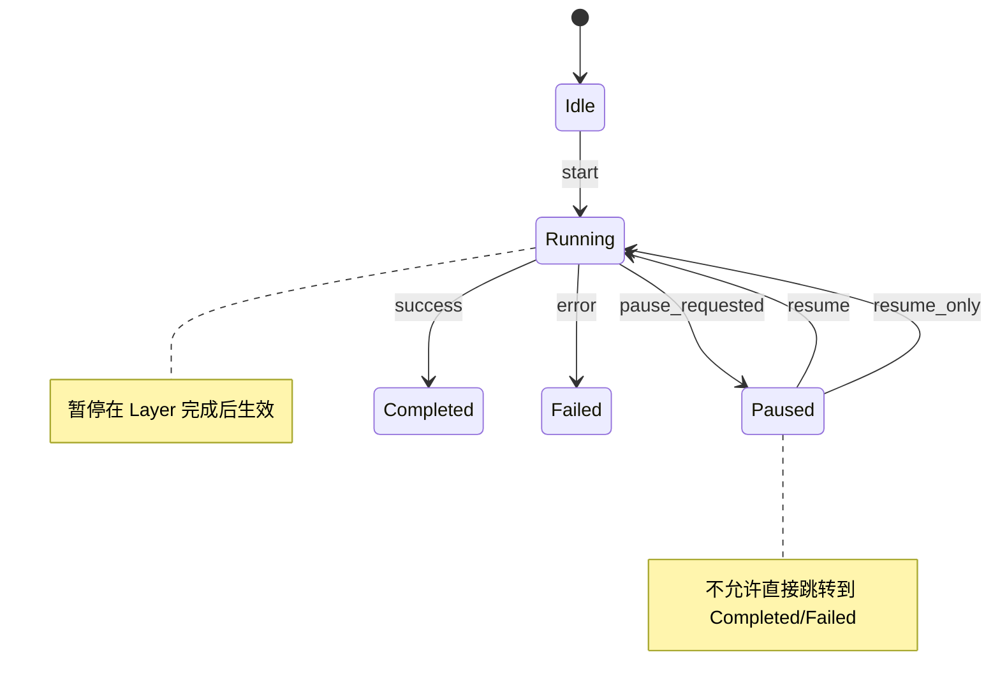

# Story 6.1: 暂停与继续迭代

Status: done

<!-- Note: Validation is optional. Run validate-create-story for quality check before dev-story. -->

Story Key: 6-1-pause-and-resume-iteration

## Epic 6 开工门槛（必须先满足）

> ⚠️ **重要**：本 Story 开工前需确认以下门槛已完成或已有明确计划。
> 跟踪文件：`docs/implementation-artifacts/epic-5-retro-action-items-2026-01-16.md`

- [x] **A1 明确"暂停/编辑/继续"的状态一致性与权限边界**
  - Owner：Winston（Architect）+ Charlie（Senior Dev）
  - 成功标准：形成一份状态与权限边界说明（包含状态机、允许的操作与触发条件），并在实现前完成评审确认。
  - 证据：`docs/implementation-artifacts/epic-6-run-control-state-design.md`

- [x] **A2 用户介入的可追踪证据链**
  - Owner：Dana（QA Engineer）+ Amelia（Dev Agent）
  - 成功标准：定义并落地"日志/状态回放入口"的最小证据链要求，确保用户介入操作可追踪与可回放。
  - 证据：`docs/implementation-artifacts/epic-6-traceability-verification.md`

- [ ] **A3 构建体积告警拆分评估**（可与本 Story 并行推进）
  - Owner：Winston（Architect）
  - 成功标准：形成可执行拆分方案清单，并在后续 Story 中落实为具体任务。
  - 证据：`docs/implementation-artifacts/epic-5-build-size-warning-2026-01-16.md`

## Key Decisions (MVP)

- **状态机权威**：`backend/src/domain/models/algorithm.rs::IterationState` 为细粒度权威状态；`backend/src/domain/models/iteration_stage.rs` 提供阶段映射权威。
- **运行控制状态**：新增顶层 `RunControlState`（Idle/Running/Paused/Stopped），存于 `backend/src/domain/types/optimization_context.rs`，与 IterationState 正交（不新增 `IterationStatus`）。
- **暂停粒度**：暂停发生在"当前节点完成后"，不中断正在执行的 Layer 处理。
- **状态持久化**：本 Story 内提供**最小暂停持久化**（建议 `backend/src/core/iteration_engine/pause_state.rs`）；Epic 7 完成后替换为完整 Checkpoint 机制。
- **WS 事件驱动**：暂停/继续操作通过 WebSocket 命令发送，状态变更通过 WS 事件推送（`iteration:paused`, `iteration:resumed`）。
- **协议权威**：WS 命名以 Architecture/Contracts 为权威（`{domain}:{action}`），PRD 示例为历史示例待同步。
- **AR2 遵循**：所有操作必须携带 `correlationId`，确保多任务场景下消息不串台。
- **UX 无障碍**：暂停/继续按钮点击区域 ≥ 44px × 44px（符合 WCAG 2.1 AA 标准）。

## Story

As a Prompt 优化用户,  
I want 在任意节点暂停迭代，并从暂停点继续,  
so that 我可以在需要时审视当前状态或进行干预。

## Acceptance Criteria

1. **Given** 优化任务正在运行  
   **When** 用户点击"暂停"按钮  
   **Then** 系统在当前节点完成后暂停迭代  
   **And** 暂停按钮点击区域 ≥ 44px × 44px（UX 无障碍规范）
   **And** 点击节点仅打开详情，不触发暂停（PRD 7.3.4）
   **And** 支持 `Space` 快捷键触发暂停/继续（UX 规范）

2. **Given** 迭代已暂停  
   **When** 用户查看界面  
   **Then** 节点图显示暂停状态（黄色节点）  
   **And** 显示"继续"按钮  
   **And** 思考面板显示"已暂停"状态指示

3. **Given** 迭代已暂停  
   **When** 用户点击"继续"按钮  
   **Then** 系统从暂停点恢复迭代  
   **And** 保持所有中间状态不变  
   **And** 节点图恢复正常状态颜色

4. **Given** 用户暂停或继续迭代  
   **When** 操作完成  
   **Then** 操作记录在日志中（含 correlationId、用户 ID、时间戳）  
   **And** 支持后续审计与状态回放

5. **Given** 系统意外重启或断线  
   **When** 用户重新连接  
   **Then** 可以恢复到暂停前的状态（最小暂停持久化实现）
   **And** Epic 7 完成后替换为完整 Checkpoint 机制

6. **Given** 用户重复点击暂停/继续  
   **When** 当前状态已处于目标状态  
   **Then** 返回成功但不重复推送事件（幂等性）

## Tasks / Subtasks

- [x] 定义运行控制状态与状态转换校验（AC: 1,2,3）
  - [x] 在 `backend/src/domain/types/optimization_context.rs` 中新增 `run_control_state: RunControlState`
  - [x] 定义 `RunControlState` 枚举（Idle/Running/Paused/Stopped）并 ts-rs 导出
  - [x] 明确 IterationState 与 RunControlState 的映射关系（暂停时 IterationState 保持不变）
  - [x] 实现状态转换校验（禁止 Paused 直接跳转 Completed/Failed）

- [x] 实现后端暂停/继续 API（AC: 1,3,4,6）
  - [x] 在 `backend/src/api/ws/connection.rs` 中添加 `task:pause` 和 `task:resume` 命令处理与 ACK
  - [x] 在 `backend/src/core/iteration_engine/pause_state.rs` 中添加 `iteration:paused` 和 `iteration:resumed` 事件推送
  - [x] 在 `backend/src/core/optimization_engine/common.rs` 中实现暂停点检测逻辑
  - [x] 确保 correlationId 全链路透传（AR2）
  - [x] 记录操作日志（tracing，包含 correlationId/user_id/action/task_id/prev_state/new_state）
  - [x] 幂等处理：重复 pause/resume 不重复推送事件

- [x] 实现前端暂停/继续交互（AC: 1,2,3,6）
  - [x] 在 `frontend/src/features/user-intervention/` 中创建 `PauseResumeControl.tsx` 组件
  - [x] 实现暂停/继续按钮（点击区域 ≥ 44px × 44px）与 `Space` 快捷键
  - [x] 集成到 RunView 页面
  - [x] 监听 WS 事件更新 UI 状态

- [x] 更新节点图暂停状态展示（AC: 2）
  - [x] 在节点图中添加暂停状态颜色（黄色）
  - [x] 更新 `frontend/src/features/visualization/` 相关组件以响应暂停状态

- [x] 实现最小暂停持久化与恢复（AC: 5）
  - [x] 在 `backend/src/core/iteration_engine/pause_state.rs` 保存暂停状态（task_id/paused_at/run_control_state/context_snapshot）
  - [x] 重连后读取并恢复暂停标志（仅恢复暂停态，不恢复完整 Checkpoint）
  - [x] 标注为临时实现，Epic 7 完成后替换为完整 Checkpoint 机制

- [x] 测试与回归（AC: 1-6）
  - [x] 后端单测：状态转换校验、WS 命令处理、幂等性
  - [x] 前端组件测试：PauseResumeControl 渲染、快捷键、禁用状态
  - [x] 集成测试：暂停 → 继续完整流程、重连恢复、重复 pause/resume
  - [x] 并发测试：多任务并行 pause/resume（taskId + correlationId 隔离）
  - [x] 回归命令：`cd backend && cargo test`；`cd frontend && npx vitest --run && npm run build`

### Review Follow-ups (AI)

> 轻量但强制：把 review 里发现的可执行项落到这里，避免"只记在聊天里/只散落在文档里"。

- [x] [AI-Review][HIGH] 实现 WS 命令处理与事件推送（`task:pause`/`task:resume` → `iteration:paused`/`iteration:resumed`），并保证 correlationId 透传与日志字段齐全。`backend/src/api/ws/connection.rs:1`
- [x] [AI-Review][HIGH] 编排层在 Layer 安全点接入 PauseController/RunControlState，确保 pause/resume 生效且幂等。`backend/src/core/optimization_engine/common.rs:1`
- [x] [AI-Review][HIGH] 最小暂停持久化需要落盘/可重启恢复（仅内存快照不满足 AC5）。`backend/src/core/iteration_engine/pause_state.rs:14`
- [x] [AI-Review][HIGH] RunView 集成 PauseResumeControl + WS 事件驱动 UI（节点图/思考面板暂停态）。`frontend/src/pages/RunView/RunView.tsx:1`
- [x] [AI-Review][HIGH] WsMessage.correlationId 设为必填，移除可空路径，确保 AR2/A2。`backend/src/shared/ws.rs:62`
- [x] [AI-Review][HIGH] 补齐 A2 必填日志字段（correlation_id/user_id/task_id/action/prev_state/new_state/iteration_state），在 WS handler 处落地。`backend/src/api/ws/connection.rs:1`
- [x] [AI-Review][MEDIUM] Space 快捷键需排除 contenteditable/Monaco 等输入区域，避免误触。`frontend/src/features/user-intervention/PauseResumeControl.tsx:73`
- [x] [AI-Review][MEDIUM] 补齐 pause/resume 的后端与集成测试覆盖（幂等性、日志字段、correlationId）。`backend/tests/ws_pause_resume_integration_test.rs:1`
- [x] [AI-Review][MEDIUM] 补全 Dev Agent Record 的 File List 与实际变更对齐。`docs/implementation-artifacts/6-1-pause-and-resume-iteration.md:356`
- [x] [AI-Review][MEDIUM] Tasks/Subtasks 勾选与实际实现对齐（已产出代码但任务仍全未勾选）。`docs/implementation-artifacts/6-1-pause-and-resume-iteration.md:83`
- [x] [AI-Review][MEDIUM] useWebSocket 实现时使用生成的 WS 类型，避免 payload 漂移。`frontend/src/types/generated/ws/index.ts:1`

## Dev Notes

### Developer Context (Read This First)

- **现状基线（已完成）**：
  - Epic 5 已完成节点图渲染（5.1）、边动画（5.2）、流式思考面板（5.3）、环节标识（5.4）
  - RunView 页面已集成可视化组件：`frontend/src/pages/RunView/RunView.tsx`
  - WS 事件目前仅有 demo 消息源：`frontend/src/features/ws-demo/`（`useWebSocket.ts` 需本 Story 新建）
  - 迭代引擎骨架：`backend/src/core/iteration_engine/`

- **Epic 6 全景（便于对齐业务价值与范围）**：
  - **6.1 暂停与继续迭代（本 Story，FR40/FR44）**
  - 6.2 编辑中间产物（FR41）
  - 6.3 对话引导老师模型（FR42）
  - 6.4 历史迭代产物查看（FR43）
  - 6.5 迭代控制：增加轮数/手动终止（FR45/FR46）

- **业务价值（为什么做）**：让用户在优化过程中拥有"掌控感"，可以随时暂停审视当前状态、进行人工干预，而不是被动等待系统完成。这是实现"人机协作优化"的核心能力之一（来源：Epic 6 / UX 设计目标）。

- **依赖关系**：
  - 依赖 Epic 4（优化引擎）提供的迭代执行机制
  - 依赖 Epic 5（可视化）提供的节点图和思考面板
  - 本 Story 仅提供最小暂停持久化，Epic 7 完成后替换为完整 Checkpoint 机制

- **范围边界（必须遵守）**：
  - 不实现 6.2（编辑中间产物）
  - 不实现 6.3（对话引导老师模型）
  - 不实现 6.4（历史迭代产物查看）

### Suggested State Machine Design



**状态转换规则**：
- `Idle → Running`：用户启动优化任务
- `Running → Paused`：用户点击暂停，当前 Layer 完成后生效
- `Paused → Running`：用户点击继续
- `Running → Completed`：所有测试通过或达到最大轮数
- `Running → Failed`：发生不可恢复错误
- `Paused → *`：不允许直接跳转到 Completed/Failed（需先继续）

### Implementation Notes (Suggested Shape)

- **WS 命令格式**（权威：Architecture/Contracts；PRD 示例为历史示例待同步）：
  ```typescript
  // 客户端发送
  { type: 'task:pause', payload: { taskId: string }, correlationId: string }
  { type: 'task:resume', payload: { taskId: string }, correlationId: string }
  
  // 服务端推送
  { type: 'iteration:paused', payload: { taskId: string, pausedAt: string, stage: StageType }, correlationId: string }
  { type: 'iteration:resumed', payload: { taskId: string, resumedAt: string }, correlationId: string }
  ```

- **状态存储（示例）**：
  ```typescript
  // Zustand store 扩展
  interface TaskStore {
    // ... 现有字段
    runControlState: 'idle' | 'running' | 'paused' | 'stopped'
    pausedAt?: string
    pausedStage?: StageType
  }
  ```

- **暂停点检测**（后端示例）：
  ```rust
  // orchestrator.rs 中的暂停点检测
  async fn run_iteration(&mut self) -> Result<()> {
      for layer in &self.layers {
          // 检查暂停标志
          if self.pause_requested.load(Ordering::SeqCst) {
              self.persist_pause_state().await?;
              self.emit_paused_event().await?;
              self.wait_for_resume().await?;
          }
          layer.execute(&mut self.context).await?;
      }
      Ok(())
  }
  ```

- **错误处理顺序（示例）**：
  ```rust
  // 仅示例：真实实现需遵循错误分级与日志策略
  self.persist_pause_state().await?; // 失败即返回错误
  if let Err(err) = self.emit_paused_event().await {
      tracing::warn!(error = ?err, "emit paused event failed");
  }
  ```

### Dev Agent Guardrails（避免常见踩坑）

- **不要在 Layer 执行中途中断**：暂停只能发生在 Layer 完成后，确保状态一致性。
- **不要忘记 correlationId**：所有 WS 命令和事件必须携带 correlationId（AR2）。
- **不要硬编码状态转换**：状态转换逻辑必须集中在状态机定义中，前端仅消费状态。
- **不要忽略错误处理**：暂停/继续操作失败时需返回用户友好的错误信息（NFR24）。
- **不要破坏现有可视化逻辑**：暂停状态是增量功能，不得影响 Epic 5 已有的节点图和流式面板。
- **不要忽略可追踪性**：所有用户介入操作必须记录日志，支持审计（A2 门槛要求）。
- **幂等性**：重复 pause/resume 必须返回成功但不重复推送事件。
- **并发隔离**：所有 pause/resume 必须按 taskId + correlationId 隔离，禁止跨任务互相影响。

### Technical Requirements（必须满足）

- 暂停/继续按钮必须满足 WCAG 2.1 AA 无障碍标准（点击区域 ≥ 44px × 44px）。
- 状态转换必须原子化，不允许中间状态。
- WS 事件必须携带完整的状态信息，前端无需额外请求。
- 暂停状态必须持久化到最小暂停持久化记录，支持重启恢复；Epic 7 完成后替换为完整 Checkpoint。
- 所有操作必须记录 tracing 日志（含 correlationId、用户 ID、时间戳）。
- 错误处理顺序：持久化失败直接返回错误；WS 推送失败记录 warn 但不阻塞；日志写入失败不阻塞主流程。

### Architecture Compliance（必须遵守）

- **WS 事件命名**：遵循 `{domain}:{action}` 格式（`task:pause`, `iteration:paused`）
- **WS envelope 形状**：遵循 `WsMessage<T>` 结构，`correlationId` 全链路透传
  - `docs/project-planning-artifacts/architecture.md#Communication Patterns`
  - `docs/developer-guides/contracts.md`
- **状态管理**：Zustand（全局）+ TanStack Query（服务端状态）
- **错误处理**：后端 `thiserror` + `anyhow`，前端统一错误响应结构
- **命名约定**：TypeScript camelCase，Rust snake_case，跨端 `serde(rename_all = "camelCase")`

### Library / Framework Requirements (Version Snapshot)

- React：项目依赖 `react@^19.2.0`
- React Router：项目依赖 `react-router@^7.12.0`
- React Flow：项目锁定 `@xyflow/react@12.10.0`
- Zustand：项目依赖 `zustand@^5.x`
- Axum：项目依赖 `axum@0.8.x`
- SQLx：项目依赖 `sqlx@0.8.x`

### File Structure Requirements（落点约束）

**后端**：
- 状态机权威：`backend/src/domain/models/algorithm.rs::IterationState`
- 阶段映射权威：`backend/src/domain/models/iteration_stage.rs`
- 运行控制状态：`backend/src/domain/types/optimization_context.rs`（新增 RunControlState）
- WS 命令处理：`backend/src/api/ws/events.rs`
- 迭代引擎暂停逻辑：`backend/src/core/iteration_engine/orchestrator.rs`
- 最小暂停持久化：`backend/src/core/iteration_engine/pause_state.rs`

**前端**：
- 暂停/继续控件：`frontend/src/features/user-intervention/PauseResumeControl.tsx`
- 状态 store：`frontend/src/stores/useTaskStore.ts`（本 Story 新建）
- RunView 集成：`frontend/src/pages/RunView/RunView.tsx`
- 节点图状态更新：`frontend/src/features/visualization/`

### Testing Requirements（必须补齐）

| 测试类型 | 覆盖范围 | 关键用例 |
| --- | --- | --- |
| 后端单测 | 状态转换校验、WS 命令处理、幂等性 | Paused → Completed/Failed 被拒绝；重复 pause/resume 不重复推送 |
| 前端组件测试 | PauseResumeControl 渲染与状态 | `Space` 快捷键、禁用态、按钮点击区域 |
| 集成测试 | 端到端暂停/继续 | 暂停 → 继续流程、重连恢复、重复 pause/resume |
| 并发测试 | 多任务隔离 | taskId + correlationId 隔离，互不影响 |
| 回归 | 全量回归 | `cargo test` + `vitest` + `vite build` 必须通过 |

### Project Structure Notes

- 在 `frontend/src/features/user-intervention/` 目录下实现用户介入相关组件（此目录在架构中已预留）。
- `frontend/src/hooks/useWebSocket.ts` 为本 Story 新建，用于发送 WS 命令。
- 复用 `frontend/src/features/visualization/` 的状态管理模式。

### References

- Epic/Story 定义：`docs/project-planning-artifacts/epics.md`（Epic 6 / Story 6.1）
- PRD 用户介入：`docs/project-planning-artifacts/prd.md#能力区域 6: 用户介入`
- UX 规范：`docs/project-planning-artifacts/ux-design-specification.md`
- 架构（WS events/correlationId）：`docs/project-planning-artifacts/architecture.md#Communication Patterns`
- WS 契约单一权威：`docs/developer-guides/contracts.md`
- Epic 6 开工门槛：`docs/implementation-artifacts/epic-5-retro-action-items-2026-01-16.md`
- 前序 Story learnings：`docs/implementation-artifacts/5-4-thinking-panel-stage-indicator.md`

## Git Intelligence Summary

- 最近可视化相关提交：
  - `e6a313c`（Epic5 复盘与 Epic6 开工门槛）
  - `9710bc5`（Story 5.4 stage indicator review merge）
  - `1ca62ed`（Story 5.3 done）
- 现有 WS 事件处理已包含 `iteration:progress`、`iteration:started` 等事件，需扩展以支持 `iteration:paused`/`iteration:resumed`。
- 现有 `ThinkingStreamState` 和节点图组件可直接复用/扩展以响应暂停状态。

## Latest Tech Information (Web/Registry Snapshot)

- React `19.2.x`：稳定版本，无需升级
- Axum `0.8.x`：稳定版本，无需升级
- 关键关注点：本 Story 不涉及依赖升级，按现有版本实现即可

## Project Context Reference

- 以 `docs/project-planning-artifacts/*.md`、`docs/developer-guides/*` 与现有代码为准

## Story Completion Status

- Status set to `done`
- Completion note: Pause/Resume 链路已补齐（ACK、持久化、审计日志、WS 事件与 UI 联动），集成测试覆盖已补充。

## Dev Agent Record

### Agent Model Used

{{agent_model_name_version}}

### Debug Log References

### Completion Notes List

- Pause/Resume ACK（`task:pause:ack`/`task:resume:ack`）已落地，支持幂等 no-op 成功返回。
- 最小暂停快照补齐 `context_snapshot`，并将落盘路径切换为 `data/pause_state`（可用 `PAUSE_STATE_DIR` 覆盖）。
- 新增 WS pause/resume 集成测试覆盖 ACK 与事件流（`ws_pause_resume_integration_test`）。
- 本次运行测试：`cd backend && cargo check && cargo test`；`cd frontend && npx vitest --run`；`cd frontend && npm run build`。

### File List

- `backend/src/api/ws/connection.rs`
- `backend/src/api/ws/events.rs`
- `backend/src/bin/gen-types.rs`
- `backend/src/core/iteration_engine/pause_state.rs`
- `backend/src/core/optimization_engine/common.rs`
- `backend/src/domain/types/optimization_context.rs`
- `backend/src/shared/ws.rs`
- `backend/src/shared/ws_bus.rs`
- `backend/tests/ws_pause_resume_integration_test.rs`
- `backend/Cargo.toml`
- `frontend/src/features/user-intervention/PauseResumeControl.tsx`
- `frontend/src/features/user-intervention/PauseResumeControl.test.tsx`
- `frontend/src/features/user-intervention/index.ts`
- `frontend/src/hooks/useWebSocket.ts`
- `frontend/src/hooks/index.ts`
- `frontend/src/pages/RunView/RunView.tsx`
- `frontend/src/stores/useTaskStore.ts`
- `frontend/src/types/generated/models/RunControlState.ts`
- `frontend/src/types/generated/models/index.ts`
- `frontend/src/types/generated/ws/TaskControlAckPayload.ts`
- `frontend/src/types/generated/ws/IterationPausedPayload.ts`
- `frontend/src/types/generated/ws/IterationResumedPayload.ts`
- `frontend/src/types/generated/ws/TaskControlPayload.ts`
- `frontend/src/types/generated/ws/index.ts`
- `docs/implementation-artifacts/6-1-pause-and-resume-iteration.md`
- `docs/implementation-artifacts/epic-6-run-control-state-design.md`
- `docs/implementation-artifacts/epic-6-traceability-verification.md`

## Review Notes

> 统一结构（便于后续检索/复用/持续改进）

### Findings

- [x] [HIGH] 补齐 WS 命令处理与 ACK，并保持 correlationId 透传。`backend/src/api/ws/connection.rs:1`
- [x] [HIGH] 暂停安全点接入 + 最小持久化补全 context_snapshot。`backend/src/core/optimization_engine/common.rs:1` `backend/src/core/iteration_engine/pause_state.rs:14`
- [x] [MEDIUM] RunView 初始化状态不再强制 running，改为基于 WS 消息驱动。`frontend/src/pages/RunView/RunView.tsx:1`
- [x] [MEDIUM] 后端新增 WS pause/resume 集成测试覆盖 ACK 与事件流。`backend/tests/ws_pause_resume_integration_test.rs:1`
- [x] [MEDIUM] Dev Agent Record File List 与 Tasks/Subtasks 已同步。

### Decisions

- [x] 引入 `task:pause:ack` / `task:resume:ack`，用于明确“成功但幂等 no-op”的返回语义。
- [x] 最小暂停快照默认落盘到 `data/pause_state`，可通过 `PAUSE_STATE_DIR` 覆盖。
- [x] 将 `context_snapshot` 作为最小恢复上下文，等待 Epic 7 完整 Checkpoint 替换。

### Risks / Tech Debt

- [ ] Epic 7 完整 Checkpoint 未实现前，恢复能力仍是“最小暂停快照”级别。

### Follow-ups

- [x] 已同步并清理 `### Review Follow-ups (AI)`。
