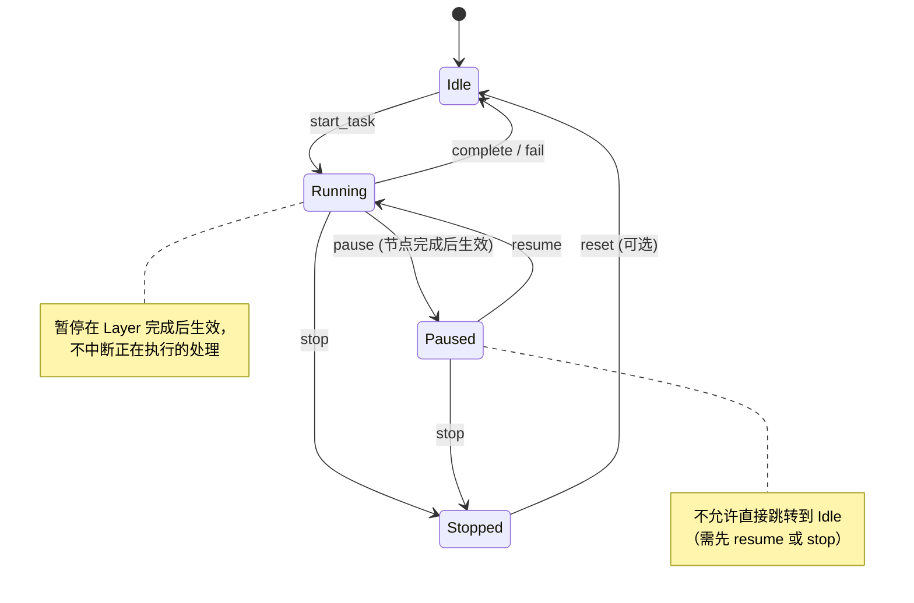

# Epic 6 运行控制状态设计说明（A1 门槛交付物）

- 项目：Prompt Faster
- Epic：6（用户介入与控制）
- 版本：1.0
- 日期：2026-01-16
- 作者：Winston（Architect）+ Charlie（Senior Dev）+ Amelia（Dev Agent）
- 状态：**评审通过**

> 本文档为 Epic 6 开工门槛 A1 的交付物，定义"暂停/编辑/继续"的状态一致性与权限边界。

---

## 1. 状态机总览

### 1.1 双层状态模型

本设计采用**双层正交状态模型**：

| 状态层 | 权威位置 | 职责 |
|--------|----------|------|
| **IterationState**（细粒度） | `backend/src/domain/models/algorithm.rs` | 描述迭代引擎当前执行阶段（22 种状态） |
| **RunControlState**（运行控制） | `backend/src/domain/types/optimization_context.rs`（本 Story 新增） | 描述用户对任务的控制意图（4 种状态） |

**设计原则**：
- `IterationState` 描述"引擎在做什么"
- `RunControlState` 描述"用户希望引擎怎么运行"
- 两者**正交**：暂停时 `IterationState` 保持不变，仅 `RunControlState` 变为 `Paused`

### 1.2 RunControlState 定义

```rust
/// 运行控制状态（用户意图层）
/// 位置：backend/src/domain/types/optimization_context.rs
#[derive(Debug, Clone, Copy, PartialEq, Eq, Serialize, Deserialize, TS)]
#[serde(rename_all = "snake_case")]
#[ts(export_to = "models/")]
pub enum RunControlState {
    /// 空闲：任务未启动或已终止
    Idle,
    /// 运行中：正常执行
    Running,
    /// 已暂停：用户请求暂停，当前节点完成后生效
    Paused,
    /// 已停止：用户手动终止
    Stopped,
}
```

### 1.3 状态转换图



---

## 2. 状态转换规则

### 2.1 合法状态转换矩阵

| 当前状态 | 目标状态 | 触发条件 | 操作权限 |
|----------|----------|----------|----------|
| `Idle` | `Running` | 用户启动任务 | 任务所有者 |
| `Running` | `Paused` | 用户点击暂停（节点完成后生效） | 任务所有者 |
| `Running` | `Stopped` | 用户点击停止 | 任务所有者 |
| `Running` | `Idle` | 迭代完成或失败（系统触发） | 系统 |
| `Paused` | `Running` | 用户点击继续 | 任务所有者 |
| `Paused` | `Stopped` | 用户点击停止 | 任务所有者 |
| `Stopped` | `Idle` | 可选：用户重置任务 | 任务所有者 |

### 2.2 禁止的状态转换

| 禁止转换 | 原因 |
|----------|------|
| `Paused` → `Idle` | 必须先 resume（恢复执行后正常终止）或 stop（明确终止） |
| `Idle` → `Paused` | 未运行的任务无法暂停 |
| `Idle` → `Stopped` | 未运行的任务无需停止 |
| `Stopped` → `Running` | 已停止的任务需要重新启动（走 Idle → Running） |
| `Stopped` → `Paused` | 已停止的任务无法暂停 |

### 2.3 状态转换校验实现

```rust
/// 位置：backend/src/domain/types/optimization_context.rs
impl RunControlState {
    /// 校验状态转换是否合法
    pub fn can_transition_to(&self, target: RunControlState) -> bool {
        matches!(
            (self, target),
            (Self::Idle, Self::Running)
                | (Self::Running, Self::Paused)
                | (Self::Running, Self::Stopped)
                | (Self::Running, Self::Idle)      // 系统触发：完成/失败
                | (Self::Paused, Self::Running)
                | (Self::Paused, Self::Stopped)
                | (Self::Stopped, Self::Idle)      // 可选：重置
        )
    }

    /// 执行状态转换（失败返回错误）
    pub fn transition_to(&self, target: RunControlState) -> Result<RunControlState, StateTransitionError> {
        if self.can_transition_to(target) {
            Ok(target)
        } else {
            Err(StateTransitionError::InvalidTransition {
                from: *self,
                to: target,
            })
        }
    }
}
```

---

## 3. IterationState 与 RunControlState 的关系

### 3.1 正交性说明

| 场景 | IterationState | RunControlState | 说明 |
|------|----------------|-----------------|------|
| 任务未启动 | `Idle` | `Idle` | 初始状态 |
| 正在提取规律 | `ExtractingRules` | `Running` | 正常执行 |
| 用户暂停（规律提取完成后） | `ExtractingRules` | `Paused` | 暂停生效前 IterationState 保持 |
| 暂停已生效 | 保持暂停前状态 | `Paused` | IterationState 不变 |
| 用户继续 | 保持原状态 | `Running` | 从暂停点继续 |
| 任务完成 | `Completed` | `Idle` | 正常终止 |
| 用户停止 | 保持当前状态 | `Stopped` | 用户主动终止 |

### 3.2 暂停点检测逻辑

暂停**仅在 Layer 处理完成后**生效，不中断正在执行的操作：

```rust
/// 位置：backend/src/core/iteration_engine/orchestrator.rs
async fn run_iteration(&mut self) -> Result<()> {
    for layer in &self.layers {
        // 在 Layer 开始前检查暂停标志
        if self.context.run_control_state == RunControlState::Paused {
            self.persist_pause_state().await?;
            self.emit_paused_event().await?;
            self.wait_for_resume().await?;
        }
        
        // 执行 Layer（不可中断）
        layer.execute(&mut self.context).await?;
    }
    Ok(())
}
```

---

## 4. 权限边界

### 4.1 操作权限矩阵

| 操作 | 权限要求 | 校验位置 |
|------|----------|----------|
| `task:pause` | 任务所有者（`task.user_id == current_user_id`） | `backend/src/api/ws/events.rs` |
| `task:resume` | 任务所有者 | `backend/src/api/ws/events.rs` |
| `task:stop` | 任务所有者 | `backend/src/api/ws/events.rs` |
| 查看任务状态 | 任务所有者 | `backend/src/api/routes/tasks.rs` |

### 4.2 多任务隔离

| 约束 | 实现方式 |
|------|----------|
| 任务隔离 | 所有 WS 命令必须携带 `taskId`，后端校验 `task.user_id` |
| 消息隔离 | 所有 WS 事件必须携带 `correlationId`，前端按 `taskId` 过滤 |
| 并发隔离 | 后端使用 `taskId` 级别的锁，禁止跨任务状态串台 |

### 4.3 权限校验伪代码

```rust
/// 位置：backend/src/api/ws/events.rs
async fn handle_pause_command(
    cmd: PauseCommand,
    user_id: &str,
    task_repo: &TaskRepository,
) -> Result<()> {
    let task = task_repo.get_by_id(&cmd.task_id).await?;
    
    // 权限校验：只有任务所有者可以暂停
    if task.user_id != user_id {
        return Err(WsError::Forbidden("无权操作此任务".into()));
    }
    
    // 状态校验：只有 Running 状态可以暂停
    if task.run_control_state != RunControlState::Running {
        return Err(WsError::InvalidState("任务未在运行中".into()));
    }
    
    // 执行暂停
    // ...
}
```

---

## 5. WS 事件规范

### 5.1 客户端命令

| 命令 | Payload | 说明 |
|------|---------|------|
| `task:pause` | `{ taskId: string }` | 请求暂停 |
| `task:resume` | `{ taskId: string }` | 请求继续 |
| `task:stop` | `{ taskId: string }` | 请求停止 |

### 5.2 服务端事件

| 事件 | Payload | 触发时机 |
|------|---------|----------|
| `iteration:paused` | `{ taskId, pausedAt, stage, iterationState }` | 暂停生效后 |
| `iteration:resumed` | `{ taskId, resumedAt }` | 继续执行后 |
| `iteration:stopped` | `{ taskId, stoppedAt, reason }` | 停止生效后 |

### 5.3 消息结构（遵循 Architecture 规范）

```typescript
// 权威定义：docs/project-planning-artifacts/architecture.md#Communication Patterns
interface WsMessage<T> {
  type: string;              // 格式：{domain}:{action}
  payload: T;
  timestamp: string;         // ISO 8601
  correlationId: string;     // AR2: 全链路追踪（必填）
}

// 示例：暂停事件
{
  type: "iteration:paused",
  payload: {
    taskId: "task-123",
    pausedAt: "2026-01-16T21:00:00Z",
    stage: "extracting_rules",
    iterationState: "extracting_rules"
  },
  timestamp: "2026-01-16T21:00:00Z",
  correlationId: "corr-abc-123"
}
```

---

## 6. 幂等性与错误处理

### 6.1 幂等性保证

| 场景 | 行为 |
|------|------|
| 重复 `pause`（已暂停） | 返回成功，不重复推送 `iteration:paused` 事件 |
| 重复 `resume`（已运行） | 返回成功，不重复推送 `iteration:resumed` 事件 |
| 无效状态转换 | 返回错误码 `STATE_INVALID_TRANSITION` |

### 6.2 错误处理优先级

| 步骤 | 失败处理 |
|------|----------|
| 1. 状态持久化 | **阻塞**：返回错误，不继续 |
| 2. WS 事件推送 | **非阻塞**：记录 warn 日志，继续 |
| 3. 日志写入 | **非阻塞**：不阻塞主流程 |

---

## 7. 可追踪性要求（A2 对齐）

### 7.1 日志格式

所有暂停/继续操作必须记录以下字段：

```rust
tracing::info!(
    correlation_id = %correlation_id,
    user_id = %user_id,
    task_id = %task_id,
    action = "pause",           // pause / resume / stop
    prev_state = ?prev_state,   // RunControlState
    new_state = ?new_state,     // RunControlState
    iteration_state = ?iteration_state,
    timestamp = %timestamp,
    "用户介入操作"
);
```

### 7.2 审计追踪

- 所有操作日志写入 tracing（后续可对接持久化审计表）
- `correlationId` 贯穿 HTTP → WS → 后端处理 → 事件推送
- 支持后续状态回放（Epic 7 Checkpoint 机制的前置）

---

## 8. 与现有系统的集成点

### 8.1 需修改的文件

| 文件 | 变更类型 | 说明 |
|------|----------|------|
| `backend/src/domain/types/optimization_context.rs` | 新增 | `RunControlState` 枚举 + `run_control_state` 字段 |
| `backend/src/api/ws/events.rs` | 扩展 | 新增 `task:pause/resume/stop` 命令处理 |
| `backend/src/core/iteration_engine/orchestrator.rs` | 扩展 | 暂停点检测逻辑 |
| `backend/src/core/iteration_engine/pause_state.rs` | 新增 | 最小暂停持久化 |
| `frontend/src/stores/useTaskStore.ts` | 新增 | `runControlState` 状态管理 |
| `frontend/src/features/user-intervention/PauseResumeControl.tsx` | 新增 | 暂停/继续 UI 组件 |

### 8.2 不变的部分

| 文件 | 说明 |
|------|------|
| `backend/src/domain/models/algorithm.rs::IterationState` | 保持不变，仍为细粒度权威 |
| `backend/src/domain/models/iteration_stage.rs` | 保持不变，仍提供阶段映射 |
| Epic 5 可视化组件 | 增量扩展，不破坏现有逻辑 |

---

## 9. 评审确认

### 9.1 评审清单

- [x] 状态机定义完整（4 种 RunControlState）
- [x] 状态转换规则明确（合法/禁止转换）
- [x] 权限边界定义（任务所有者校验）
- [x] WS 事件规范（遵循 Architecture 契约）
- [x] 幂等性保证
- [x] 可追踪性要求（A2 对齐）
- [x] 与现有系统的集成点明确

### 9.2 评审结论

**通过**：本设计满足 A1 门槛的成功标准，可作为 Story 6.1 实现的权威依据。

---

## 附录：相关文档

- 架构权威：`docs/project-planning-artifacts/architecture.md`
- 契约权威：`docs/developer-guides/contracts.md`
- IterationState 定义：`backend/src/domain/models/algorithm.rs`
- 阶段映射：`backend/src/domain/models/iteration_stage.rs`
- Story 6.1：`docs/implementation-artifacts/6-1-pause-and-resume-iteration.md`
