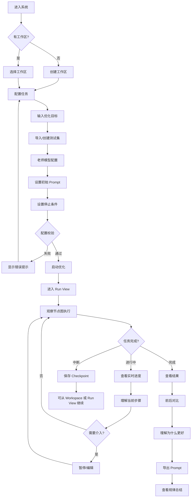
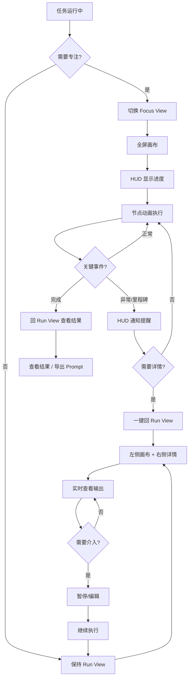
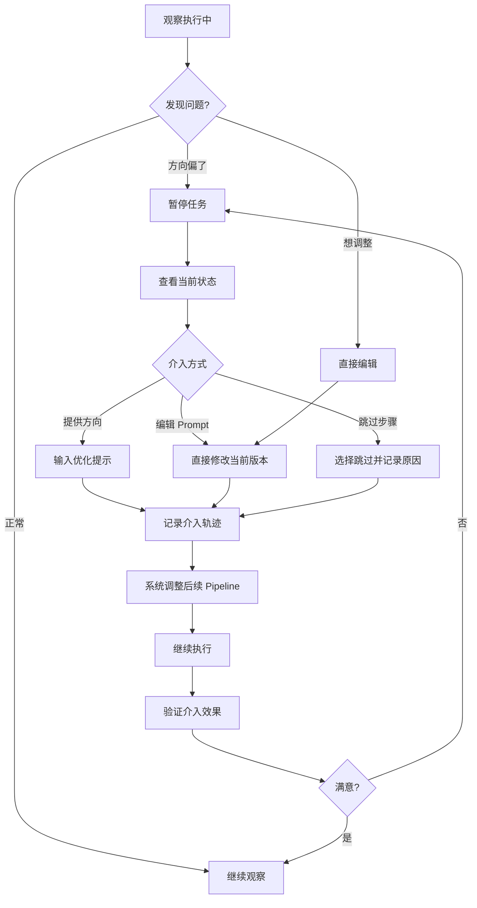
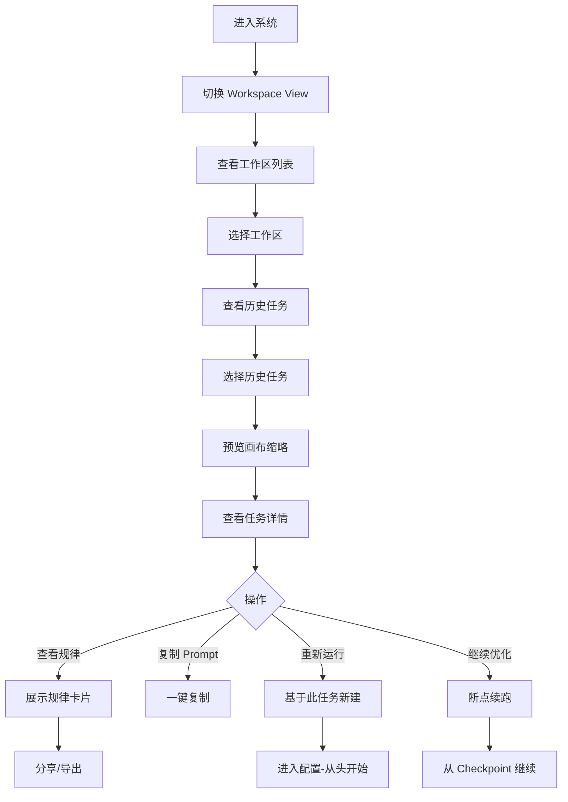

# UX Design Specification - Prompt Faster

**Author:** 耶稣
**Date:** 2025-12-19

---

<!-- UX design content will be appended sequentially through collaborative workflow steps -->

## Executive Summary

### Project Vision

**Prompt Faster** 是一款将 Prompt 优化过程从"黑盒"变成"玻璃盒"的桌面端工具。核心理念是：用户不仅获得更好的 Prompt，还能理解"为什么更好"。

**产品定位**：将学术界已验证的优化方法（OPRO、Reflexion、DSPy SIMBA、PromptWizard）首次以开箱即用的产品形态呈现给普通用户。

### Target Users

| 用户类型 | 特征 | 核心需求 |
|----------|------|----------|
| **低代码开发者** | 产品经理/运营，使用 Dify 等低代码平台 | 系统化的优化流程，告别"改 A 坏 B"的循环 |
| **专业 AI 开发者** | 有编程能力，直接调用 LLM API | 将已有方法论自动化，节省重复劳动 |

**共同痛点**：都有明确的测试集和质量标准，但手工迭代效率极低、缺乏系统化方法。

**非目标用户**：一次性美化 Prompt 的用户 — 本产品聚焦于有明确测试集和迭代需求的场景，不为"快速润色"设计过度入口。

### Design Philosophy

**"开箱即用 + 按需进阶 + 生产级可靠"**

- 📌 官方默认参数确保新手也能成功完成优化
- 📌 高级功能不隐藏，但按需展开
- 📌 充分的指示引导和说明贯穿全程
- 🎨 支持两种使用模式：高频日常使用 & 任务驱动的低频使用
- 🎨 UX 不仅追求好看和易用，还要体现「生产工具的可靠感」— 呼应后端的 Checkpoint、持久化、断点续跑等可靠性设计

> 标签说明：`📌 事实/PRD约束` `🎨 UX决策` `🔮 愿景`

### Design Principles

| 原则 | 说明 |
|------|------|
| **动画完整实现** | 所有流程动画必须完善实现，用户可选择隐藏但不可缺失 |
| **可视化不阻塞执行** | 前端展示与后端执行解耦，详情展示不影响优化效率 |
| **双模式体验** | 简洁模式聚焦结果，详细模式展示完整动画过程 |
| **结果优先，理解按需** | 先给结果，"为什么"通过点击展开获取 |
| **非阻断式介入** | 智能提示徽章提醒可能需要帮助，不打断流程 |
| **失败积极化** | 失败时展示"学到了什么"，降低挫败感 |
| **渐进式复杂度** | 默认隐藏技术细节，高级用户可展开 |

### Key Design Challenges

| 挑战 | 设计方向 |
|------|----------|
| **复杂流程的可视化** | 节点图清晰呈现四层迭代，避免信息过载 |
| **"玻璃盒"与"易用性"的平衡** | 默认简洁，详情按需展开 |
| **人工介入的时机与方式** | 智能提示 + 非打断式介入入口 |
| **专业用户与新手兼容** | 渐进式复杂度，同一界面满足两者 |
| **实时流式输出的 UX** | 流畅的思考过程展示，降低等待焦虑 |

### Design Opportunities

| 机会 | 差异化价值 |
|------|------------|
| **"理解为什么"的洞察体验** | 竞品都是黑盒，这是核心差异化 |
| **渐进式复杂度** | 默认简单，高级功能按需展开 |
| **迭代历史可视化回溯** | 让用户"回看"优化之旅，强化知识传递 |

### UX Risk Prevention Measures

| 风险类别 | 关键预防措施 |
|----------|-------------|
| **首次体验** | 快速开始向导 + 示例任务 + 术语本地化 |
| **核心价值** | 优化前后对比可视化 + 持续进度反馈 |
| **人机协作** | 清晰状态指示 + 常驻介入入口 + 智能建议提示 |
| **可视化** | 默认聚焦模式 + 全局/聚焦可切换 + 状态图例 |
| **情感体验** | 积极措辞 + 失败学习展示 + 成功庆祝动画 |
| **断点恢复** | 上下文摘要 + 时间线视图 |

## Core User Experience

### Defining Experience

**核心体验双循环模型**

Prompt Faster 的核心体验由两个相互交织的循环组成：

| 循环 | 描述 | 关键交互 |
|------|------|----------|
| **配置-等待-获取** | 用户配置任务 → 系统自动优化 → 用户获取结果 | 任务启动、结果导出 |
| **观察-理解-介入** | 用户观察过程 → 理解发生什么 → 适时介入引导 | 迭代可视化、人工介入 |

两个循环同等重要，设计上不应偏废任何一方。

### Platform Strategy

| 维度 | 决定 | 标签 |
|------|------|------|
| **平台** | 桌面端 Web 应用（本地部署） | 📌 |
| **输入方式** | 鼠标/键盘为主 | 📌 |
| **网络需求** | 完全本地运行，仅 LLM API 调用需联网 | 📌 |
| **核心技术** | React Flow 节点图可视化 | 📌 |

### Interaction Scenarios Matrix

**任务生命周期完整交互场景：**

#### 准备阶段

| 场景 | 说明 | 无摩擦目标 |
|------|------|-----------|
| 老师模型配置 | API 密钥设置、模型选择 | 一次配置持久保存，连接测试即时反馈 |
| 工作区选择/新建 | 多工作区隔离管理 | 最近工作区快捷入口 + 搜索 |
| 执行目标输入 | 描述 Prompt 应该做什么 | 提供模板和示例，支持自然语言 |
| 测试集导入与预览 | 支持 CSV/JSON/YAML | 拖拽 + 自动识别 + 表格预览 + 错误高亮 |
| 优化目标与停止条件 | 准确率目标、轮数上限 | 智能默认值 + 一句话解释 |
| 高级参数配置 | 四层架构参数、Trait 微调 | 默认隐藏，按需展开，参数有说明 |

#### 执行阶段

| 场景 | 说明 | 无摩擦目标 |
|------|------|-----------|
| 启动优化任务 | 开始自动迭代 | 一键启动，配置检查前置 |
| 观察迭代进展 | 节点图 + 流式输出 | 实时更新无需刷新，双模式可切换 |
| 人工介入 | 暂停/编辑/引导 | 常驻控制按钮，编辑反馈即时可见 |
| 日志与调试 | 详细日志、错误诊断 | 按需展开，专业用户可深入 |

#### 完成阶段

| 场景 | 说明 | 无摩擦目标 |
|------|------|-----------|
| 结果理解 | 前后对比 + 原因说明 | 清晰可视化，"为什么更好"一目了然 |
| 结果导出 | Prompt 复制、历史导出 | 一键复制按钮常驻可见 |
| 知识沉淀 | 优化总结 + 规律提炼 | 自动生成可带走的知识 |

#### 恢复/复用

| 场景 | 说明 | 无摩擦目标 |
|------|------|-----------|
| 工作区切换 | 历史工作区恢复 | "你上次在这里"摘要 + 时间线 |
| 断点续跑 | 中断后继续 | 明确的"继续" vs "重新开始"选择 |

### Critical Success Moments

| 时刻 | 触发条件 | 设计要点 | 标签 |
|------|----------|----------|------|
| **"原来如此"** | 用户理解"为什么这个 Prompt 更好" | 清晰的前后对比 + 原因说明 | 📌 |
| **"我控制着"** | 用户成功介入并引导优化方向 | 编辑反馈即时可见 | 🎨 |
| **"它懂我"** | 系统智能提示正好是用户想要的 | 智能建议命中用户需求 | 🔮 |
| **"成功了！"** | 优化目标达成 | 庆祝动画 + 成就展示 | 🎨 |
| **"我学到了"** | 用户带走可迁移的知识 | 优化总结 + 规律提炼 | 📌 |
| **"无缝继续"** | 断点恢复后顺利继续 | 上下文摘要清晰 | 🎨 |

### Experience Principles

| 原则 | 说明 | 来源 |
|------|------|------|
| **双循环并重** | 配置-结果 与 观察-介入 两个循环同等重要 | 🎨 本步骤决策 |
| **首次体验双目标** | 既要"快速看到结果"，也要"理解发生什么" | 🎨 本步骤决策 |
| **全生命周期无摩擦** | 15 个交互场景都有明确的无摩擦目标 | 🎨 本步骤决策 |
| **关键时刻设计** | 6 个关键成功时刻需要专门设计 | 🎨 本步骤决策 |

## Desired Emotional Response

### Primary Emotional Goals

**三位一体的主导情感：**

| 情感 | 定义 | 设计体现 |
|------|------|----------|
| **掌控感** | "我在引导这个过程" | 随时可介入、状态清晰、操作可预期 |
| **理解感** | "我学到了东西" | 过程透明、原因可见、知识可带走 |
| **成就感** | "我做到了" | 进步可视化、成功有庆祝、失败也有收获 |

三种情感同等重要，贯穿整个用户旅程。

**差异化情感：成就感** 🎯

> 市场上缺乏开箱即用且专业的 Prompt 优化工具。用户使用 Prompt Faster 时，应该感受到"专业工具赋能"带来的成就感 — 不是"我在用一个玩具"，而是"我在用一个专业工具，它帮我做到了以前做不到的事"。
>
> **成就感来自专业工具赋能 + 知识内化，而不是纯视觉烟花。**

### Emotional Journey Mapping

> ⚠️ 以下为**设计目标**，实际体验需通过迭代验证；不同用户/任务可能略有差异。

| 阶段 | 期望情感 | 避免情感 | 设计策略 |
|------|----------|----------|----------|
| **首次发现** | 好奇 + 期待 | 畏惧 + 怀疑 | 专业但不吓人的视觉设计 |
| **配置任务** | 顺畅 + 自信 | 困惑 + 不确定 | 智能默认 + 清晰引导 |
| **等待执行** | 好奇 + 参与感 | 焦虑 + 无聊 | 有内容可看、进度可感知 |
| **观察过程** | 惊喜 + 理解 | 迷茫 + 疏离 | 关键信息突出、详情按需 |
| **遇到失败** | 平静 + 学习 | 沮丧 + 挫败 | 积极措辞 + 下一步建议 |
| **成功完成** | 成就 + 满足 | 平淡 + 空虚 | 庆祝动画 + 成果展示 |
| **带走知识** | 成长 + 收获 | 遗忘 + 茫然 | 优化总结 + 规律提炼 |

### Emotional Design Implications

| 情感目标 | UX 设计策略 | 能力锚点 |
|----------|-------------|----------|
| **掌控感** | 常驻控制按钮、清晰状态指示、非阻断式介入、编辑即时反馈 | 暂停/继续/引导 API |
| **理解感** | 前后对比可视化、"为什么更好"说明、规律提炼自动生成 | 四层架构透明输出 |
| **成就感** | 进度百分比、成功庆祝动画、里程碑标记、可分享的成果卡片 | 优化目标达成判定 |
| **信任感** | 专业视觉设计、错误诚实反馈、数据持久化提示 | 📌 断点续跑 / Checkpoint / SQLite 持久化 |
| **好奇心** | 每轮迭代新发现高亮、"系统发现了..."的惊喜提示 | 规律抽取层输出 |

### Emotional Design Principles

| 原则 | 说明 | 标签 |
|------|------|------|
| **三感并重** | 掌控感、理解感、成就感同等重要，设计不可偏废 | 🎨 |
| **成就感差异化** | 成就感来自专业工具赋能 + 知识内化，而不是纯视觉烟花 | 🎨 |
| **失败不沮丧** | 每次失败都是学习，积极措辞 + 下一步建议 | 🎨 |
| **等待不焦虑** | 等待时有内容可看，进度可感知，不催促 | 🎨 |
| **专业不吓人** | 专业感来自可靠，而非复杂；开箱即用 | 🎨 |

## UX Pattern Analysis & Inspiration

### Inspiring Products Analysis

#### 按维度参考的产品

| 维度 | 主参考产品 | 借鉴重点 |
|------|-----------|----------|
| **节点图可视化** | Dify、n8n | 节点状态编码、连线动画、聚焦模式 |
| **人机协作** | Cursor、Perplexity | Diff 预览、推理过程展示 |
| **迭代对比** | Weights & Biases | 多轮对比图表、最佳版本标记 |
| **专业工具感** | Linear、Vercel | 极简视觉、状态徽章、构建日志 |
| **流式输出** | ChatGPT、Claude | 打字机效果、思考过程动画 |

#### 核心参考产品详解

| 产品 | 参考价值 | 具体借鉴 |
|------|----------|----------|
| **Linear** | 专业感 + 极简 | 状态徽章、键盘优先、清晰信息层级 |
| **Dify** | 节点图交互 | 用户已熟悉的心智模型，降低学习成本 |
| **Vercel** | 长时任务状态 | 构建进度、日志流式输出、一键重试 |
| **Cursor** | 人机协作 | 编辑介入的 Diff 预览、可撤销操作 |
| **W&B** | 迭代可视化 | 指标趋势图、版本对比、最佳标记 |

### Transferable UX Patterns

#### 节点图模式

| 模式 | 说明 | 应用场景 |
|------|------|----------|
| **聚焦模式** | 当前执行节点居中放大，其他节点淡化 | 执行阶段观察 |
| **小地图导航** | 右下角缩略图，显示当前视口位置 | 复杂流程导航 |
| **连线流动动画** | 数据流向用粒子/光点动画表示 | 实时执行可视化 |
| **节点状态编码** | 颜色 + 图标 + 微动画表示不同状态 | 全局状态感知 |

#### 节点内部动画模式（重点）

| 节点类型 | 动画效果 | 目的 |
|----------|----------|------|
| **LLM 节点** | 流式文字 + 光标闪烁 + 思考脉冲 | 展示 AI 正在"思考" |
| **评估节点** | 进度环 + 分数跳动 + 结果色块 | 展示评估进行中 |
| **代码节点** | 代码高亮滚动 + 执行光带扫过 | 展示代码运转 |
| **比较节点** | 双栏 Diff 动画 + 变化高亮闪烁 | 展示对比过程 |
| **规律提取** | 关键词浮现 + 连线生成动画 | 展示知识沉淀 |

#### 状态反馈模式

| 模式 | 说明 | 应用场景 |
|------|------|----------|
| **进度百分比** | 整体进度 + 当前轮次进度双层显示 | 降低等待焦虑 |
| **里程碑标记** | 关键节点完成时的微庆祝动画 | 增强成就感 |
| **错误高亮** | 错误节点红色脉冲 + 问题摘要浮层 | 快速定位问题 |
| **成功动画** | 优化完成时的庆祝粒子效果 | 强化成就感 |

### Anti-Patterns to Avoid

| 反面模式 | 来源 | 避免策略 |
|----------|------|----------|
| **节点图复杂难导航** | Dify | 聚焦模式 + 小地图 + 层级折叠 |
| **长任务无进度感** | Jupyter | 持续进度反馈 + 阶段里程碑 |
| **日志冗长淹没关键** | CI/CD 工具 | 分层日志 + 摘要优先 + 按需展开 |
| **动画过度炫技** | 部分产品 | 动画服务于理解，可关闭但不缺失 |
| **静态等待无反馈** | 传统工具 | 任何等待都有视觉反馈 |

### Design Inspiration Strategy

#### 采纳策略

| 策略 | 来源 | 理由 |
|------|------|------|
| **Linear 的极简专业感** | Linear | 生产工具定位 |
| **Dify 的节点图心智模型** | Dify | 目标用户熟悉 |
| **Vercel 的任务状态模式** | Vercel | 长时任务最佳实践 |
| **流式输出 + 节点内动画** | ChatGPT/Claude | 实时感 + 参与感 |

#### 适配策略

| 模式 | 原模式 | 适配方向 |
|------|--------|----------|
| **W&B 的迭代对比** | 专业 ML 工具 | 简化为普通用户可理解的对比视图 |
| **Cursor 的 Diff** | 代码编辑器 | 适配为 Prompt 文本的对比展示 |

#### 避免策略

| 避免 | 理由 |
|------|------|
| **纯技术日志堆砌** | 与"理解为什么"目标冲突 |
| **复杂节点图无导航** | 造成迷失感 |
| **静态等待界面** | 与"好奇+参与感"目标冲突 |

#### 差异化方向

> **核心差异化**：竞品都是黑盒，Prompt Faster 的节点内动画让用户"看见 AI 在想什么"——不仅是结果透明，过程也透明。这是"玻璃盒"理念在视觉层的极致体现。

## Design System Foundation

### Design System Choice

**首选组合：shadcn/ui + Tailwind CSS + Framer Motion + React Flow**

| 组成 | 职责 | 说明 |
|------|------|------|
| **shadcn/ui** | 基础组件库 | 基于 Radix primitives，继承其可访问性与交互品质；代码可控、极简风格 |
| **Tailwind CSS** | 样式系统 | 快速开发、一致性强、动画类支持；React Flow 官方示例大量使用 |
| **Framer Motion** | 动画引擎 | 专业级动画能力，支持复杂节点内动画 |
| **React Flow** | 节点图引擎 | 📌 PRD 已确定 |

### Rationale for Selection

| 选择理由 | 说明 |
|----------|------|
| **PRD 一致性** | 与 PRD 技术选型完全对齐，无冲突 |
| **视觉目标匹配** | shadcn/ui 的设计语言与 Linear 式极简非常接近 |
| **动画能力** | Framer Motion 可实现节点内流动动画、状态过渡等高要求效果 |
| **代码可控** | shadcn/ui 采用"复制粘贴"模式，组件代码完全在手，便于深度定制 |
| **生态兼容** | shadcn/ui + Tailwind 与 React Flow 无缝集成 |

### Implementation Approach

#### 单一设计系统原则

> ⚠️ **不再额外引入 Ant Design / Chakra UI / MUI 等完整 UI 库**，避免双设计语言、双样式系统冲突。

#### 动画实现标准

> 🎬 **动画按 V2+ 规格完整实现**——所有节点内动画（LLM 流式输出、代码执行光带、规律提取动画等）从一开始就完善实现，用户可选择隐藏但不可缺失。

| 动画类型 | 实现要求 |
|----------|----------|
| **节点状态过渡** | 高亮、展开/收起、聚焦模式切换 |
| **LLM 节点** | 流式文字 + 光标闪烁 + 思考脉冲 |
| **评估节点** | 进度环 + 分数跳动 + 结果色块 |
| **代码节点** | 代码高亮滚动 + 执行光带扫过 |
| **比较节点** | 双栏 Diff 动画 + 变化高亮闪烁 |
| **规律提取** | 关键词浮现 + 连线生成动画 |
| **成功庆祝** | 庆祝粒子效果 + 里程碑动画 |

### Customization Strategy

| 维度 | 策略 |
|------|------|
| **色彩系统** | 基于 shadcn/ui 默认主题，定制 Prompt Faster 品牌色 |
| **组件扩展** | 在 shadcn/ui 基础上扩展节点图专用组件 |
| **动画标准** | 定义统一的 easing、duration 标准，保持动画一致性 |
| **暗色模式** | 预留暗色模式支持，符合专业工具用户偏好 |

#### 局部参考（不引入）

| 产品 | 参考维度 | 说明 |
|------|----------|------|
| **Ant Design X** | AI 对话交互模式 | 仅参考交互模式，不引入组件库 |
| **Radix / Ark UI** | 无障碍原语 | shadcn/ui 已内置，无需额外引入 |

## Defining Core Experience

### One-Line Core Experience

> **「在可视化节点图里，看着 AI 和我一起迭代 Prompt，不但变得更好，还让我真正理解为什么更好。」**

**次级收益：**
> 通过测试集驱动的自动迭代，把原本需要数小时的手工试错压缩到分钟级自动迭代，同时保持生产级可靠性。

### Experience Dual-Loop Model

这个核心体验由两个循环共同构成：

| 循环 | 流程 | 用户角色 |
|------|------|----------|
| **配置-获取循环** | 配置任务 → 自动优化 → 获得更好 Prompt | 发起者、接收者 |
| **观察-介入循环** | 观察过程 → 理解发生什么 → 适时介入引导 | 观察者、协作者 |

两个循环同等重要，用户不再把 Prompt Faster 当成「一个帮我吐结果的黑盒」，而是**一个一起看过程、一起做决策的协作者**。

### User Mental Model

| 维度 | 现状（黑盒） | Prompt Faster（玻璃盒） |
|------|-------------|------------------------|
| **做法** | 手工改 → 测试 → 再改 → 循环 | 自动化迭代，人工按需介入 |
| **痛点** | "改 A 坏 B"、效率低、无系统方法 | 系统化优化 + 全局评估 |
| **期望** | "给我个更好的 Prompt" | 不仅给结果，还给理解 |
| **心智** | 输入 → 魔法 → 输出 | 输入 → 看见过程 → 理解输出 |

### Success Criteria

| 标准 | 说明 |
|------|------|
| **"原来如此"时刻** | 用户理解了"为什么这个 Prompt 更好" |
| **掌控感** | 用户感觉自己在引导优化，而非被动等待 |
| **过程可视化** | 任意时刻，用户都能说出「系统现在在第几轮、第几步、在做什么」 |
| **效率提升** | 把原本需要数小时的手工试错压缩到分钟级自动迭代（数量级提升） |
| **知识带走** | 用户结束后能说出"我学到了 X 规律" |

### Novel vs. Established Patterns

| 类型 | 模式 | 说明 |
|------|------|------|
| **已建立** | 节点图交互 | 用户熟悉 Dify 等工具，心智模型已有 |
| **已建立** | 流式输出 | ChatGPT/Claude 已普及 |
| **创新** | 节点内动画 | 让用户"看见 AI 在想什么" |
| **创新** | 过程透明 + 原因说明 | 竞品都是黑盒，这是核心差异化 |
| **创新** | 知识沉淀 | 自动提炼规律，用户带走知识 |

### Experience Mechanics

#### 1. Initiation（启动）

| 步骤 | 用户行为 | 系统响应 |
|------|----------|----------|
| 选择工作区 | 新建或选择已有工作区 | 显示工作区状态 |
| 配置任务 | 输入目标、导入测试集 | 智能默认 + 即时预览 |
| 启动优化 | 点击开始按钮 | 配置校验 + 任务启动 |

#### 2. Interaction（交互）

| 步骤 | 用户行为 | 系统响应 |
|------|----------|----------|
| 观察进展 | 查看节点图 + 流式输出 | 实时更新 + 动画展示 |
| 理解过程 | 点击节点查看详情 | 展示"为什么"说明 |
| 介入引导 | 暂停 / 编辑 / 提供方向 | 即时反馈 + 继续执行 |

#### 3. Feedback（反馈）

| 信号 | 含义 | 视觉表现 |
|------|------|----------|
| 进度百分比 | 整体 + 当前轮次进度 | 双层进度条 |
| 节点状态 | 当前执行位置 | 颜色编码 + 聚焦动画 |
| 分数变化 | 优化效果 | 分数跳动 + 趋势图 |
| 错误提示 | 遇到问题 | 红色脉冲 + 建议浮层 |

#### 4. Completion（完成）

| 步骤 | 用户行为 | 系统响应 |
|------|----------|----------|
| 查看结果 | 浏览最终 Prompt | 前后对比 + 原因说明 |
| 导出成果 | 复制 / 导出 | 一键复制 + 格式选择 |
| 知识沉淀 | 查看优化总结 | 规律提炼 + 可分享卡片 |

## Visual Design Foundation

### Color System

#### 整体策略

| 维度 | 选择 | 说明 |
|------|------|------|
| **基调** | 中性色为主（灰阶） | 不抢节点图视觉，专业工具常见做法 |
| **强调色** | 蓝紫色系（indigo/violet 500-600） | AI/技术感，区别于 Dify 的纯蓝 |
| **状态色** | 标准语义色（调低暗色模式饱和度） | 绿=成功，黄=警告，红=错误 |
| **默认模式** | 暗色优先 | 专业工具用户偏好，节点图更突出 |

#### 层级区分

| 层级 | 用途 | 色值示例 |
|------|------|----------|
| **UI 外框/导航** | 界面骨架 | zinc/slate 系列 |
| **UI 背景** | 面板、侧边栏 | `#111213` |
| **画布背景** | 节点图区域 | `#050608`（更深，让节点"浮起来"） |

#### 强调色使用规范

> ⚠️ **强调色使用范围严格控制：**
> - ✅ 主按钮、选中态高亮、当前执行节点边框/光晕
> - ❌ 避免大面积背景使用（压迫感强）

#### 节点色与品牌色协调

> 🎨 **强调色和节点状态色需统一规划**，避免品牌强调色与节点类型/状态色产生认知冲突。节点色系统将在后续 UI 设计阶段详细定义。

#### 浅色主题预留

> 📋 **浅色主题基础 token 同步规划**，确保未来能在不同使用场景（分享、演示、印刷、文档截图）下保持良好可读性。

### Typography System

#### 字体选择

| 用途 | 字体 | 说明 |
|------|------|------|
| **主字体（英文）** | 系统字体栈优先 | `system-ui, -apple-system, "SF Pro Text", "Segoe UI", Inter, sans-serif` |
| **代码/Prompt 字体** | JetBrains Mono / Fira Code | 等宽字体，提升可读性和工程感 |
| **中文字体** | 系统无衬线 | 苹方 / 微软雅黑 / 思源黑体等，中性、几何感，避免手写或过度装饰 |

#### 等宽字体使用范围

| 使用 ✅ | 不使用 ❌ |
|--------|----------|
| Prompt 文本展示 | 导航、按钮文字 |
| 调用示例 | 标题、说明文字 |
| 调试日志区 | 普通段落 |
| 代码片段 | 表单标签 |

#### 字体规模

| 级别 | 用途 | 大小 |
|------|------|------|
| **H1** | 页面标题 | 24-28px |
| **H2** | 区块标题 | 18-20px |
| **H3** | 子标题 | 14-16px |
| **Body** | 正文 | 14px |
| **Small** | 辅助文字 | 12px |
| **Code** | Prompt/代码 | 13-14px |

### Spacing & Layout Foundation

#### 间距系统

| 基准单位 | 说明 |
|----------|------|
| **4px** | 最小间距单位 |
| **8px** | 常用组件内间距 |
| **16px** | 区块间间距 |
| **24px** | 大区块分隔 |

#### 布局原则

| 原则 | 说明 |
|------|------|
| **高效密集** | 专业工具需要高信息密度，但保持呼吸感 |
| **层级清晰** | UI 框架 → 画布 → 节点 → 节点内容，四层清晰 |
| **焦点突出** | 当前执行节点始终在视觉中心 |

### Accessibility Considerations

| 维度 | 要求 |
|------|------|
| **对比度** | 文字与背景对比度 ≥ 4.5:1（WCAG AA） |
| **色盲友好** | 状态不仅依赖颜色，配合图标/形状 |
| **键盘导航** | 所有交互支持键盘操作 |
| **焦点可见** | 焦点状态清晰可辨 |

## Design Direction Decision

### Design Directions Explored

| 方向 | 核心特征 | 适用场景 |
|------|----------|----------|
| **A. 全画布中心型** | 节点图占 85%+，UI 极简 | 深度监控、演示、截图 |
| **B. 双栏协作型** | 左画布 + 右详情面板 | 主工作流程、人机协作 |
| **C. 三栏工作台型** | 左导航 + 中画布 + 右详情 | 多工作区管理、历史回看 |

### Chosen Direction: 三视图模式架构

> 🎯 **不是三选一，而是三种视图模式可切换**——MVP 一步到位实现完整的视图切换体验。

| 视图模式 | 布局基础 | 主要用途 | 默认/可选 |
|----------|----------|----------|-----------|
| **Run View** | B 双栏协作型 | 观察过程 + 理解原因 + 介入引导 | 📌 默认视图 |
| **Focus View** | A 全画布中心型 | 长时间监控、演示、全屏专注 | 可切换 |
| **Workspace View** | C 三栏工作台型 | 多工作区管理、历史记录、任务切换 | 可切换 |

> 📦 三个视图模式在 MVP 中都需要「**形态存在且可用**」，但**功能深度可按阶段扩展**（例如 Focus View 的高级动效、Workspace View 的高级过滤）。

### View Responsibilities

#### Run View（核心体验主舞台）

| 维度 | 说明 |
|------|------|
| **定位** | 核心体验的主要承载界面 |
| **左侧画布** | 观察过程（配置-获取循环） |
| **右侧面板** | 理解 & 介入（观察-介入循环） |
| **默认视图** | 启动优化后自动进入 |

**右侧详情面板承载内容：**

| 内容类型 | 说明 |
|----------|------|
| **反思报告** | 老师模型的结构化分析 |
| **失败原因** | 为什么这个版本不够好 |
| **规律提炼** | 自动发现的优化规律 |
| **版本对比** | Prompt 前后 Diff |
| **介入表单** | 暂停/编辑/提供方向的操作入口 |

#### Focus View（演示/监控视图）

| 维度 | 说明 |
|------|------|
| **定位** | 「玻璃盒」的极致视觉表达 |
| **主要场景** | 演示/展示、长任务监控（低交互高可视） |
| **特点** | UI chrome 极简，节点图 + 动画成主角 |

**MVP 实现范围：**

| 必须有 | 可延后 |
|--------|--------|
| 全屏画布 | 小地图导航 |
| HUD 状态条（轮次/节点/进度） | 粒子/光点流动动画 |
| 节点状态颜色 + 基础动画 | 复杂节点内部动效 |

#### Workspace View（任务与历史管理中心）

| 维度 | 说明 |
|------|------|
| **定位** | 任务与历史的管理中心，而非主运行画面 |
| **主要场景** | 多工作区管理、历史回看、任务切换 |
| **特点** | 不在运行时常驻，避免信息轰炸 |

**MVP 实现范围：**

| 必须有 | 可延后 |
|--------|--------|
| 左侧：工作区列表 + 最近 N 次历史 | 复杂过滤/搜索 |
| 中间：选中任务画布缩略/状态卡片 | 多任务对比 |
| 右侧：任务关键信息（名称/模型/得分/时间） | 高级标签/分组 |

### Implementation Approach

#### 视图切换交互

| 切换方式 | 说明 |
|----------|------|
| **顶栏切换器** | 下拉菜单或 Tab 切换 |
| **快捷键** | `Cmd/Ctrl + 1/2/3` 快速切换 |
| **自动切换** | 启动优化后自动进入 Run View |

#### 技术实现策略

> 🔧 **同一画布 + 面板的不同布局状态**，而不是三套独立 UI。

| 策略 | 说明 |
|--------|------|
| **layoutMode 控制** | 用顶层 `layoutMode`（`'run' \| 'focus' \| 'workspace'`）控制布局 |
| **组件稳定挂载** | Canvas & Panel 始终挂载，只是布局变化 |
| **状态自然保持** | 避免组件卸载/重挂载的复杂处理 |

#### 视图间状态保持

| 策略 | 说明 |
|--------|------|
| **画布位置保持** | 切换视图时节点图位置/缩放不变 |
| **选中状态保持** | 选中的节点在切换后仍然选中 |
| **面板内容连续** | 右侧详情面板内容跨视图保持 |

> ⚠️ 在视图结构差异较大的场景（例如 Workspace View 的画布缩略），优先保证「选中任务/节点的一致性」，画布精确视口可按需要简化。

## User Journey Flows

### Critical User Journeys

| 旅程 | 目标 | 对应视图 |
|------|------|----------|
| **首次优化** | 第一次使用系统完成一轮优化 | Run View |
| **长任务监控** | 启动任务后监控进度 | Run View → Focus View |
| **人工介入** | 暂停/编辑/提供方向 | Run View |
| **结果导出** | 导出优化后的 Prompt 和规律 | Run View（主导出）/ Workspace View（历史导出） |
| **历史回看** | 查看过往任务和规律 | Workspace View |

> 💡 结果导出主要在 Run View 完成（运行中/完成后立即导出）；历史任务的规律分享/导出入口位于 Workspace View。

### Journey 1: 首次优化



**配置步骤：**

| 步骤 | 必填/可选 | 说明 |
|------|-----------|------|
| **优化目标** | 必填 | 自然语言描述期望效果 |
| **测试集** | 必填 | 可导入已有或使用示例集 |
| **老师模型** | 可选 | 默认使用系统推荐配置（Dify / 直连 LLM / 其他 Provider），如果已完成全局配置则自动带出，仅在需要时覆盖 |
| **初始 Prompt** | 必填 | 待优化的 Prompt |
| **停止条件** | 可选 | 默认：达到目标准确率或轮数上限 |

> 📦 通过**智能默认 + 示例测试集**，首轮体验可压缩为 **3-4 个关键决策**，其他步骤由向导兜底。

**关键交互点：**

| 步骤 | 用户需要 | 系统提供 |
|------|----------|----------|
| 配置任务 | 清晰的输入指引 | 智能默认 + 即时预览 |
| 观察进度 | 知道"现在在干嘛" | 节点高亮 + 流式输出 |
| 理解结果 | 知道"为什么更好" | 结构化原因说明 |

**断点续跑入口：**

> 如果任务中断，用户可从 Workspace View 或 Run View 顶部入口选择「继续优化」，利用 Checkpoint 机制接续上次状态。

### Journey 2: 长任务监控



**视图切换逻辑：**

| 场景 | 推荐视图 | 说明 |
|------|----------|------|
| 需要理解 + 介入 | Run View | 左画布 + 右详情 |
| 低交互长时间监控 | Focus View | 全屏画布 + HUD |

**Focus View 关键事件提醒：**

> 当出现**异常/任务完成/关键里程碑**时，即便用户停留在 Focus View，也会通过 HUD 或轻量通知提示，并提供「一键回 Run View 查看详情」。

**Focus View MVP 深度：**

| 必须有 | 可延后 |
|--------|--------|
| 全屏画布 | 小地图导航 |
| HUD 状态条（轮次/节点/进度） | 粒子/光点流动动画 |
| 节点状态颜色 + 基础动画 | 复杂节点内部动效 |
| 关键事件 HUD 通知 | 高级通知自定义 |

### Journey 3: 人工介入



**介入方式：**

| 介入类型 | 触发场景 | 操作 | 后续影响 |
|----------|----------|------|----------|
| **提供方向** | 优化方向偏了 | 输入自然语言指令 | 指令纳入下轮迭代 |
| **编辑 Prompt** | 想手动微调 | 直接修改文本 | 以修改版本继续优化 |
| **跳过步骤** | 某步骤无意义 | 标记跳过 + 记录原因 | 后续 pipeline 不再运行该节点 |

> ⚠️ 实际可跳过的步骤集合由算法引擎定义，并在 UI 中以标记提示，避免用户跳过关键必需节点。

**轨迹记录：**

> 📝 所有人工介入（方向提示、编辑、跳过）会被记录在该轮迭代的轨迹中，用于：历史回看、规律提炼、失败/成功案例展示。

### Journey 4: 历史回看



**操作区分：**

| 操作 | 行为 | 适用场景 |
|------|------|----------|
| **重新运行** | 拷贝配置/测试集/参数，从初始状态重新跑 | 验证新的老师模型/参数 |
| **继续优化** | 利用最后一次 Checkpoint，从已有最优版本继续 | 接续之前的进度 |

> ⚠️ 两种操作的历史轨迹处理不同：重新运行创建独立轨迹，继续优化延续原有轨迹。

> 💡 **导出职责拆分**：运行中任务的 Prompt 导出入口主要位于 Run View；历史任务的规律分享/导出入口主要位于 Workspace View。

### Journey Patterns

#### 导航模式

| 模式 | 说明 | 应用场景 |
|------|------|----------|
| **视图切换** | 顶栏切换器 + 快捷键 | 跨视图导航 |
| **面板展开/收起** | 右侧详情面板可折叠 | 调整信息密度 |
| **节点聚焦** | 点击节点时，系统尽量将其移动到视口中心附近 | 画布导航 |

#### 反馈模式

| 模式 | 说明 | 应用场景 |
|------|------|----------|
| **双层进度** | 整体进度 + 当前轮次进度 | 长任务监控 |
| **状态颜色编码** | 统一的节点状态色 | 快速理解状态 |
| **流式文字** | 实时显示 LLM 输出 | 观察思考过程 |

#### 错误处理模式

| 模式 | 说明 | 应用场景 |
|------|------|----------|
| **即时提示** | 配置错误即时反馈 | 任务启动前 |
| **优雅降级** | 单步失败不中断整体 | 运行中容错 |
| **一键重试** | 失败步骤可重试 | 错误恢复 |
| **全局错误处理** | API 鉴权失败等全局性错误暂停任务，给出明确指引 | 不可恢复错误 |

### Flow Optimization Principles

| 原则 | 说明 |
|------|------|
| **最短路径到价值** | 依赖智能默认和向导，将首次必须显式决策的步骤控制在 3-4 个 |
| **渐进式复杂度** | 高级配置隐藏在"更多选项" |
| **随时可中断** | 任何时刻可暂停、保存、退出，支持断点续跑 |
| **状态永远可知** | 任何时刻都能回答"现在在干嘛" |

## Component Strategy

### Design System Components

#### shadcn/ui 可用组件

| 类别 | 组件 | 用途 |
|------|------|------|
| **布局** | Card, Separator, Tabs | 区块划分、视图切换 |
| **表单** | Input, Textarea, Button, Select, Checkbox, Switch | 配置表单、介入表单 |
| **反馈** | Toast, Alert, Progress, Skeleton | 状态提示、加载状态 |
| **导航** | Dropdown Menu, Command, Menubar | 顶栏、右键菜单 |
| **弹窗** | Dialog, Sheet, Popover, Tooltip | 详情展示、确认操作 |
| **数据展示** | Table, Badge, Avatar | 历史列表、状态标签 |

> 💡 以上为与本产品强相关的典型组件，非完整列表，实际使用可按需扩展。

#### React Flow 提供能力

| 能力 | 说明 |
|------|------|
| **节点系统** | 自定义节点、节点状态、节点分组 |
| **边连接** | 自定义边样式、动画边（如使用 `animated` 属性或自定义边组件实现） |
| **画布控制** | 缩放、平移、小地图、控制器 |
| **交互** | 节点选中、拖拽、连接 |

> 💡 以上为与本产品强相关的典型能力，非完整列表，实际使用可按需扩展。

### Custom Components

#### 自定义组件需求（Gap Analysis）

| 组件 | 需求来源 | 设计系统覆盖 |
|------|----------|-------------|
| **IterationNode** | 核心画布 | ❌ 需自定义 |
| **StreamingText** | 观察思考过程 | ❌ 需自定义 |
| **PromptDiff** | 理解变化 | ❌ 需自定义 |
| **DualProgress** | 长任务监控 | ❌ 需自定义 |
| **StatusHUD** | Focus View | ❌ 需自定义 |
| **InsightCard** | 规律提炼展示 | ❌ 需自定义 |
| **InterventionForm** | 人工介入 | 部分可用，需定制 |
| **TaskCard** | Workspace View | ❌ 需自定义 |

#### IterationNode（迭代节点）

| 维度 | 说明 |
|------|------|
| **用途** | 表示一轮迭代的状态和关键信息 |
| **内容** | 轮次编号、当前状态、得分、耗时、关键指标 |
| **状态** | pending / running / success / failed / skipped |
| **交互** | 点击选中 → 右侧面板显示详情 |
| **动画** | running 状态：边框脉冲 + 内部进度条 |

**变体：**

| 变体 | 说明 |
|------|------|
| **Compact** | 仅显示状态色 + 轮次号（用于缩略视图） |
| **Default** | 显示状态 + 得分 + 简要信息 |
| **Expanded** | 展开显示完整迭代摘要 |

#### StreamingText（流式文本）

| 维度 | 说明 |
|------|------|
| **用途** | 实时显示 LLM 输出，逐字/逐行渲染 |
| **内容** | 文本内容 + 光标指示 |
| **状态** | streaming / complete / error |
| **交互** | 可复制、可滚动、自动滚动到底部 |
| **性能** | 虚拟滚动（长文本场景） |

> 💡 **复用原则**：同一 StreamingText 组件将同时用于节点内部和右侧详情面板，确保视觉与交互一致，减少重复实现。

#### PromptDiff（Prompt 对比）

| 维度 | 说明 |
|------|------|
| **用途** | 对比两个版本的 Prompt 差异 |
| **内容** | 左侧旧版 / 右侧新版 / 高亮差异 |
| **模式** | Side-by-side / Inline / Unified |
| **交互** | 可切换模式、可复制任一版本 |
| **高亮** | 绿色=新增、红色=删除、黄色=修改 |

**MVP vs V2 拆分：**

| 阶段 | 实现范围 |
|------|----------|
| **MVP（P0）** | 使用 Monaco DiffEditor 提供 side-by-side 基础对比 + 内置高亮 |
| **V2（P1）** | 多模式切换（Inline/Unified）、token 级细粒度高亮、复杂交互 |

> 💡 MVP 阶段直接复用 Monaco 的 DiffEditor 组件，可快速实现「理解为什么更好」的核心体验，无需从零开发。

#### DualProgress（双层进度）

| 维度 | 说明 |
|------|------|
| **用途** | 同时显示整体进度和当前轮次进度 |
| **内容** | 外层：整体进度 / 内层：当前轮次进度 |
| **状态** | 进行中 / 暂停 / 完成 |
| **交互** | 点击可展开详细进度信息 |

#### StatusHUD（状态浮层）

| 维度 | 说明 |
|------|------|
| **用途** | Focus View 的轻量状态展示 |
| **内容** | 当前轮次、当前节点、整体进度、关键事件 |
| **位置** | 画布顶部或底部，半透明 |
| **交互** | 点击事件可跳转 Run View |
| **自动隐藏** | 无活动时渐隐，有事件时渐显 |

#### InsightCard（规律卡片）

| 维度 | 说明 |
|------|------|
| **用途** | 展示自动提炼的优化规律 |
| **内容** | 规律标题、描述、适用场景、置信度 |
| **交互** | 可收藏、可分享、可查看来源案例 |
| **变体** | Compact（列表用）/ Full（详情用） |

#### InterventionForm（介入表单）

| 维度 | 说明 |
|------|------|
| **用途** | 人工介入的操作入口 |
| **内容** | 介入方式选择 + 对应输入区 |
| **方式** | 提供方向（文本输入）、编辑 Prompt（代码编辑器）、跳过（确认 + 原因） |
| **状态** | 可用 / 不可用（任务未暂停时） |

> ⚠️ **状态机关联**：InterventionForm 的启用/禁用状态由任务状态机控制（仅在 running/paused 状态下可用），避免出现与后端状态不一致的操作入口。

#### TaskCard（任务卡片）

| 维度 | 说明 |
|------|------|
| **用途** | Workspace View 的任务列表项 |
| **内容** | 任务名、最后得分、运行时间、状态、缩略图 |
| **交互** | 点击选中、右键菜单（重新运行/继续优化/删除） |
| **状态** | completed / running / paused / failed |

### Component Implementation Strategy

#### 设计原则

| 原则 | 说明 |
|------|------|
| **Token 复用** | 所有自定义组件使用 Tailwind + shadcn/ui 的设计 Token |
| **可组合** | 复杂组件由基础组件组合而成 |
| **状态驱动** | 组件状态由外部 props 控制，内部无业务逻辑 |
| **动画一致** | 所有动画使用 Framer Motion，遵循统一的 duration/easing |

#### 技术实现

| 策略 | 说明 |
|------|------|
| **React Flow 节点** | IterationNode 作为 React Flow 自定义节点 |
| **Radix 基础** | 复用 shadcn/ui 底层 Radix 原语（Popover、Dialog 等） |
| **Framer Motion** | 所有状态切换、进入退出动画 |
| **Monaco Editor** | Prompt 编辑 + Diff 对比使用 Monaco（VS Code 编辑器内核） |

> ⚠️ **Monaco 按需加载**：Monaco Editor 仅在需要编辑/对比 Prompt 时按需加载（dynamic import + SSR disabled），避免对初次加载性能造成过大影响。

### Component-to-View/Journey Mapping

| 组件 | 视图 | 相关 Journey |
|------|------|-------------|
| **IterationNode** | Run / Focus / Workspace（缩略） | 首次优化、长任务监控、历史回看 |
| **StreamingText** | Run（右侧详情 + 节点内） | 首次优化、人工介入 |
| **DualProgress** | Run 顶部状态栏 | 长任务监控 |
| **StatusHUD** | Focus | 长任务监控 |
| **PromptDiff** | Run（结果对比区） | 首次优化（理解结果阶段）、结果导出 |
| **InsightCard** | Run / Workspace | 结果导出、历史回看 |
| **InterventionForm** | Run（右侧面板） | 人工介入 |
| **TaskCard** | Workspace（左/中） | 历史回看 |

> 💡 此表将 Step 10 的 User Journey 与 Step 11 的 Components 串联，便于研发判断「实现 Journey X 至少需要哪些组件 ready」。

### Implementation Roadmap

#### Phase 1：核心组件（MVP 必须）

| 组件 | 优先级 | 依赖旅程 |
|------|--------|----------|
| **IterationNode** | P0 | 首次优化、长任务监控 |
| **StreamingText** | P0 | 首次优化 |
| **DualProgress** | P0 | 长任务监控 |
| **InterventionForm** | P0 | 人工介入 |
| **StatusHUD** | P0 | 长任务监控（Focus View） |
| **TaskCard** | P0 | 历史回看（Workspace View） |
| **PromptDiff（简化版）** | P0 | 理解结果（使用 Monaco DiffEditor） |

#### Phase 2：增强组件（V2+）

| 组件 | 优先级 | 依赖旅程 |
|------|--------|----------|
| **InsightCard** | P1 | 规律沉淀 |
| **PromptDiff（高级模式）** | P1 | 多模式切换、token 级高亮 |
| **AnimatedEdge** | P1 | Focus View 高级动效 |

## UX Consistency Patterns

### Button Hierarchy

#### 按钮类型

| 类型 | 视觉权重 | 用途 | 示例 |
|------|----------|------|------|
| **Primary** | 最高 | 主要行动 CTA | 「启动优化」「保存」 |
| **Secondary** | 中等 | 次要操作 | 「取消」「重置」 |
| **Ghost** | 最低 | 辅助操作 | 「更多选项」「折叠」 |
| **Destructive** | 高（警示色） | 破坏性操作 | 「删除任务」「清空」 |
| **Icon-only** | 低 | 工具栏 / 紧凑场景 | 播放/暂停、复制、展开 |

#### 使用规则

| 规则 | 说明 |
|------|------|
| **每个主要区域/对话框最多 1 个 Primary** | 整个 Run View 视图级主 CTA 只能有一个；单独弹出的 Dialog 内也只允许一个 Primary 按钮 |
| **破坏性操作需二次确认** | Dialog 确认，不可撤销时明确告知；确认文案须**明确说明作用范围**（仅此任务/整个工作区）和**是否可撤销** |
| **加载态禁用 + Spinner** | 防止重复点击 |
| **点击区域分级** | 桌面端主操作 ≥ 36-40px；若需兼容触摸屏/平板形态，Primary CTA ≥ 44px；图标按钮视觉可小，点击区域通过 padding 放大 |

### Feedback Patterns

#### 状态反馈类型

| 类型 | 颜色 | 图标 | 用途 |
|------|------|------|------|
| **Success** | 绿色 | ✓ Check | 操作成功、任务完成 |
| **Error** | 红色 | ✕ X / ⚠ Alert | 操作失败、校验错误 |
| **Warning** | 黄色 | ⚠ Alert | 风险提示、接近限制 |
| **Info** | 蓝色 | ℹ Info | 中性提示、引导信息 |

#### 反馈形式

| 形式 | 持续时间 | 用途 |
|------|----------|------|
| **Toast** | 3-5s 自动消失 | 轻量反馈（复制成功、保存成功） |
| **Inline Message** | 持久 | 表单校验、字段级错误 |
| **Banner** | 持久 / 手动关闭 | 全局提示（API 额度不足、版本更新） |
| **Dialog** | 需用户操作 | 重要确认、错误详情 |

#### 反馈时机

| 场景 | 反馈方式 |
|------|----------|
| 任务启动成功 | Toast + 自动进入 Run View |
| 配置校验失败 | Inline Error + 聚焦到错误字段 |
| 单步执行失败 | 节点状态变红 + 右侧面板显示错误详情 |
| 全局 API 错误 | Banner + 暂停任务 + 修复指引 |
| 任务完成 | HUD 通知（Focus View）/ Toast + 面板更新（Run View） |

### Form Patterns

#### 表单布局

| 场景 | 布局 |
|------|------|
| 配置任务 | 垂直堆叠，标签在上 |
| 介入表单 | 紧凑布局，标签在左 |
| 设置页面 | 分组卡片，标签在左 |

#### 校验规则

| 规则 | 说明 |
|------|------|
| **即时校验** | 失焦时校验，错误即时显示 |
| **提交校验** | 提交时二次校验，滚动到第一个错误 |
| **错误状态** | 红色边框 + 错误图标 + 错误文案 |
| **成功状态** | 绿色对勾（仅在需要时显示） |

#### 输入增强

| 模式 | 说明 |
|------|------|
| **智能默认** | 预填系统推荐值 |
| **即时预览** | Prompt 输入时预览效果 |
| **字数/限制提示** | 显示当前长度 / 最大限制 |
| **自动保存** | 草稿自动保存，提示「已保存」 |

### Loading & Empty States

#### 加载状态

| 场景 | 表现 |
|------|------|
| **页面加载** | 骨架屏（Skeleton） |
| **数据加载** | 局部 Spinner + 文字提示 |
| **长任务执行** | 节点动画 + 双层进度条（整体轮次/当前轮次步骤）；可选：根据历史运行数据显示**预估剩余轮次/阶段** |
| **按钮加载** | Spinner 替换图标 + 禁用 |

> ⚠️ 由于 LLM + 网络请求时延波动较大，**避免显示绝对时间预估**，优先使用轮次/阶段进度，时间预估可作为 V2 基于历史统计的增强功能。

#### 空状态

| 场景 | 表现 |
|------|------|
| **首次使用** | 引导插图 + 「创建第一个任务」CTA |
| **无历史任务** | 简洁提示 + 「开始优化」CTA |
| **搜索无结果** | 提示 + 「清除筛选」建议 |
| **错误恢复** | 错误说明 + 「重试」CTA |

### Navigation Patterns

#### 视图切换

| 模式 | 交互 |
|------|------|
| **顶栏切换器** | 下拉菜单 / Tab，显示当前视图 |
| **快捷键** | `Cmd/Ctrl + 1/2/3` 切换 Run/Focus/Workspace |
| **面包屑** | Workspace > 工作区名 > 任务名 |

#### 面板导航

| 模式 | 交互 |
|------|------|
| **面板展开/收起** | 点击边缘或快捷键 `Cmd/Ctrl + B` |
| **面板内 Tab** | 详情 / 历史 / 规律 切换 |
| **上下文菜单** | 右键节点/任务 → 操作菜单 |

### Modal & Overlay Patterns

#### 弹窗类型

| 类型 | 用途 | 关闭方式 |
|------|------|----------|
| **Dialog** | 确认操作、重要表单 | 按钮关闭 |
| **Sheet** | 侧边详情、设置面板 | 点击遮罩 / 关闭按钮 |
| **Popover** | 轻量操作、下拉菜单 | 点击外部 |
| **Tooltip** | 说明文字 | 鼠标移出 |

#### 使用规则

| 规则 | 说明 |
|------|------|
| **遮罩可关闭** | 除确认弹窗外，点击遮罩可关闭 |
| **ESC 关闭** | 所有弹窗支持 ESC 关闭 |
| **焦点陷阱** | 弹窗内 Tab 循环，不会跳出 |
| **动画一致** | 进入淡入 + 缩放，退出淡出 |

### Accessibility Patterns

#### 键盘导航

| 模式 | 快捷键 |
|------|--------|
| 视图切换 | `Cmd/Ctrl + 1/2/3` |
| 面板切换 | `Cmd/Ctrl + B` |
| 暂停/继续 | `Space`（仅在焦点不在输入区域时） |
| 聚焦下一节点 | `Tab` / `Arrow`（仅在焦点不在输入区域时） |
| 打开命令面板 | `Cmd/Ctrl + K` |

> ⚠️ **快捷键冲突边界**：`Space` / `Tab` 等快捷键**仅在焦点不在 Input/Textarea/Monaco Editor 时生效**；当焦点位于文本编辑区域时，保留其原生行为，不劫持键盘事件。

#### 焦点管理

| 场景 | 行为 |
|------|------|
| 弹窗打开 | 焦点移入弹窗，关闭后恢复 |
| 表单错误 | 焦点移到第一个错误字段 |
| Toast 出现 | 不抢夺焦点，屏幕阅读器朗读 |

## Responsive Design & Accessibility

### Responsive Strategy

#### 桌面优先策略

Prompt Faster 定位为**专业级桌面生产工具**，采用 Desktop-first 设计策略：

| 策略 | 说明 |
|------|------|
| **主战场** | 桌面端（≥1280px），充分利用大屏空间展示复杂画布与多面板布局 |
| **次要场景** | 平板横屏（≥1024px），简化面板但保留核心画布功能 |
| **最小支持** | 平板竖屏（768px），仅支持只读查看与基础操作 |
| **不支持** | 手机端 — 复杂画布交互与长文本编辑不适合小屏 |

#### 各尺寸适配策略

| 尺寸 | 布局策略 | 功能范围 |
|------|----------|----------|
| **≥1440px（大桌面）** | 三栏完整展开，增加留白与舒展布局 | 完整功能 + 增强体验 |
| **1280–1439px（标准桌面）** | 三栏：左导航 + 中画布 + 右面板，全部可用 | 完整功能 |
| **1024–1279px（小桌面/平板横屏）** | 三栏：左导航可收起 + 中画布 + 右面板可收起 | 完整功能 |
| **768–1023px（平板竖屏）** | 单栏：顶部导航 + 画布全屏 + 底部操作栏 | 只读查看、基础操作 |
| **<768px** | 不支持，引导用户使用桌面端 | — |

### Breakpoint Strategy

| 断点 | 像素值 | 主要变化 |
|------|--------|----------|
| **2xl** | ≥1440px | 完整三栏 + 增强留白与舒展布局 |
| **xl** | 1280–1439px | 完整三栏布局（主战场） |
| **lg** | 1024–1279px | 三栏布局，左右面板可收起 |
| **md** | 768–1023px | 单栏布局，画布全屏，功能精简 |
| **—** | <768px | 不支持，显示「请使用桌面端」提示 |

**Tailwind CSS 配置示例：**

```javascript
theme: {
  screens: {
    'md': '768px',   // 平板竖屏最小支持
    'lg': '1024px',  // 平板横屏 / 小桌面
    'xl': '1280px',  // 标准桌面（主战场）
    '2xl': '1440px', // 大桌面增强体验
  }
}
```

### Accessibility Strategy

#### WCAG 合规级别

| 级别 | 目标 | 说明 |
|------|------|------|
| **WCAG 2.1 AA** | MVP 必须 | 行业标准，覆盖色彩对比、键盘导航、屏幕阅读器 |
| **WCAG 2.1 AAA** | V2 可选 | 部分增强（如更高对比度模式） |

#### 核心无障碍要求

| 类别 | 要求 | 实现方式 |
|------|------|----------|
| **色彩对比** | 文本 ≥ 4.5:1，大文本 ≥ 3:1 | Tailwind 主题色板预定义 |
| **键盘导航** | 所有核心操作可通过键盘完成 | Tab 序列 + 快捷键（见 Step 12） |
| **焦点指示** | 焦点元素有明显视觉指示 | `ring-2 ring-offset-2` |
| **屏幕阅读器** | 语义化 HTML + ARIA 标签 | Radix/shadcn 原生支持 |
| **点击区域** | 桌面 ≥ 36px，触控 ≥ 44px | 见 Step 12 按钮规则 |
| **动画减弱** | 尊重 `prefers-reduced-motion` | Framer Motion 条件禁用 |

#### 特殊场景处理

| 场景 | 处理方式 |
|------|----------|
| **React Flow 画布** | 节点添加 `aria-label`，边不需要（装饰性） |
| **StreamingText** | 使用 `aria-live="polite"` 通知屏幕阅读器 |
| **Monaco Editor** | 自带较完整的无障碍支持（屏幕阅读器/键盘导航），集成时仅需确保外层不遮挡或劫持其焦点和快捷键 |
| **Toast 通知** | `role="status"` + `aria-live="polite"` |

### Testing Strategy

#### 响应式测试

| 方法 | 工具 | 覆盖范围 |
|------|------|----------|
| **浏览器模拟** | Chrome DevTools | 开发阶段快速验证 |
| **真机测试** | BrowserStack / 实际设备 | iPad Pro、MacBook、外接显示器 |
| **跨浏览器** | Chrome, Firefox, Safari, Edge | 确保一致性 |

#### 无障碍测试

| 方法 | 工具 | 用途 |
|------|------|------|
| **自动化扫描** | axe DevTools, Lighthouse | CI 集成，发现常见问题 |
| **屏幕阅读器** | VoiceOver (macOS), NVDA (Windows) | 验证语义和朗读 |
| **键盘测试** | 纯键盘操作 | 验证 Tab 序列和快捷键 |
| **色彩模拟** | Chrome DevTools 色盲模拟 | 验证色彩区分度 |

### Implementation Guidelines

#### 响应式开发

| 规则 | 说明 |
|------|------|
| **Desktop-first 设计心智** | 以桌面端（xl/2xl）为主设计画布和布局，再用 Tailwind 的断点为较小屏幕调整（Tailwind 仍使用 mobile-first 的 min-width 断点） |
| **相对单位优先** | `rem`, `%`, `vw/vh`，避免固定 `px`（点击区域除外） |
| **弹性布局** | `flex` / `grid` + `min/max-width` 保证伸缩 |
| **图片优化** | `srcset` + `loading="lazy"` |

#### 无障碍开发

| 规则 | 说明 |
|------|------|
| **语义化 HTML** | 使用 `<main>`, `<nav>`, `<section>`, `<article>` |
| **ARIA 补充** | 仅在语义不足时使用，避免过度标注 |
| **跳过链接** | 页面顶部添加「跳转到主内容」链接 |
| **减弱动画** | `@media (prefers-reduced-motion: reduce)` 禁用非必要动画 |
| **高对比度模式** | 支持 `forced-colors` 媒体查询（V2） |
